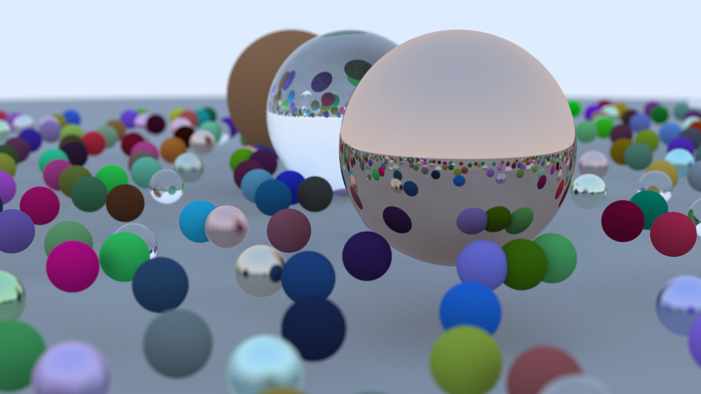

# Book 1: [Ray Tracing in One Weekend](https://raytracing.github.io/books/RayTracingInOneWeekend.html)

✅ Done

- Video explaining aperture and depth of field (defocus blur): https://www.youtube.com/watch?v=Bs9L_9iBVLQ
- Final scene took around 45 min to render on Intel Core i5 13600K




# Book 2: [Ray Tracing: The Next Week](https://raytracing.github.io/books/RayTracingTheNextWeek.html)

## Motion blur

What a pixel really represents:

> Samples per pixel is no longer “just anti-aliasing”.
> It’s the number of Monte Carlo samples used to integrate *everything* the camera measures.

A pixel is **not** a single ray.

A pixel is an **integral over many dimensions**:

```math
\text{pixel} =
\int_{\text{pixel area}}
\int_{\text{lens}}
\int_{\text{time}}
L(x, y, \ell, t)\, dA\, d\ell\, dt
```

Each of these integrals corresponds to a physical effect:

| Dimension          | Effect             |
| ------------------ | ------------------ |
| pixel area         | anti-aliasing      |
| lens aperture      | depth of field     |
| time               | motion blur        |
| (later) wavelength | spectral rendering |

So we normalize:

```math
\text{pixel} =
\frac{1}{A_{\text{pixel}}}
\frac{1}{A_{\text{lens}}}
\frac{1}{\Delta t}
\int\!\!\int\!\!\int
L(x, y, \ell, t)\;
dA\; d\ell\; dt
```
This converts:

- **total energy → average radiance (color) **

Monte Carlo sampling is a cheap estimation of the above integral. 


WIP:

- [x] Motion Blur
- [ ] BVH
- [ ] Texure Mapping
- [ ] Perlin Noise
- [ ] Quadrilaterals
- [ ] Lights
- [ ] Instances
- [ ] Volumes
- [ ] Final Scene #2
